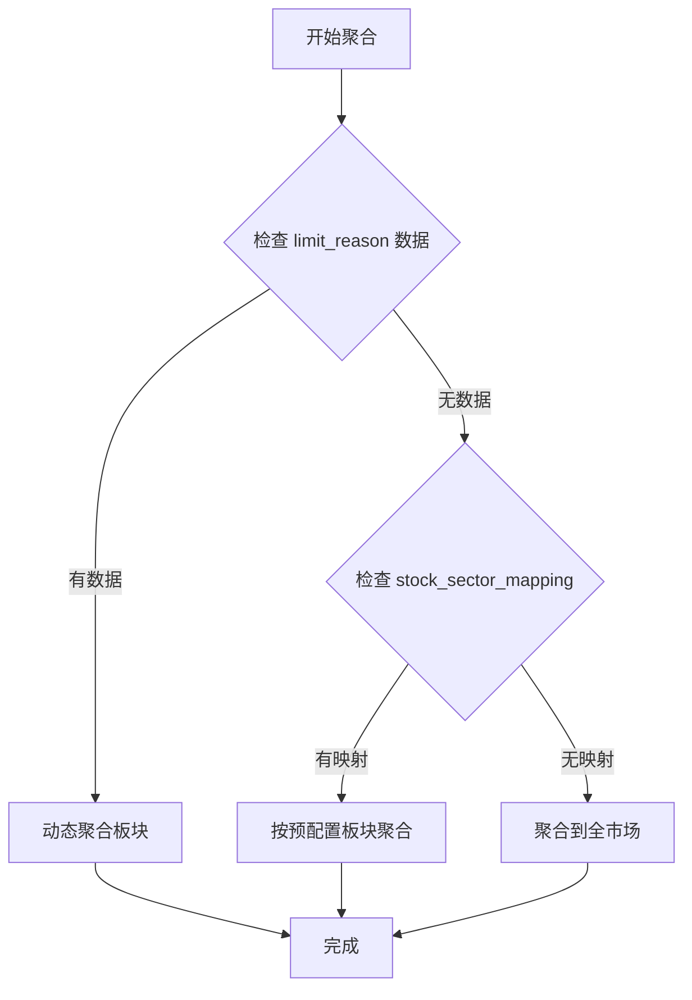

# 开发准则与问题修复记录

> **最高准则：交易分析需要极致的实时性，数据越实时对交易决策越有利。**

## 🎯 三大核心原则

1. **极致实时性** ⭐⭐⭐⭐⭐
   - 采集间隔：1-2 秒（非 15 分钟）
   - 数据延迟：< 3 秒
   - 每次采集后立即聚合

2. **实时动态分析** ⭐⭐⭐
   - 禁止硬编码板块列表
   - 从实时数据动态提取板块
   - 保留全部 A 股数据

3. **展示实际数据** ⭐⭐⭐
   - 显示数据实际日期（非系统日期）
   - 显示细分板块（非"全市场"）
   - 表格展示 + 用户可排序

4. **板块涨停排行展示规范** ⭐⭐⭐⭐⭐
   - 显示真实板块名称（商业航天、人形机器人等）
   - 显示板块内涨停个股数量
   - 严格遵守同花顺展示格式

5. **问题修复与部署自动化** ⭐⭐⭐⭐⭐
   - 所有问题修复必须记录文档
   - 一键部署脚本持续完善
   - 脚本智能判断执行步骤
   - 避免重复操作（幂等性）

---

## 📋 目录
- [核心设计原则](#核心设计原则)
- [问题修复记录](#问题修复记录)
- [技术架构决策](#技术架构决策)
- [数据流程](#数据流程)
- [部署流程](#部署流程)
- [常见陷阱](#常见陷阱)

---

## 核心设计原则

### 0. 极致实时性原则 ⭐⭐⭐⭐⭐
**交易分析需要极致的实时性，数据越实时对交易决策越有利**

> "在股市中，1秒的延迟可能意味着错失涨停板机会。系统必须在最短时间内更新数据，让交易者捕捉到最快的市场变化。"

- ⚡ **采集频率**：默认 2 秒，推荐交易时段 1 秒
- ⚡ **聚合延迟**：每次采集后立即聚合，无额外延迟
- ⚡ **数据新鲜度**：看板数据延迟 < 3 秒（2秒采集）或 < 2 秒（1秒采集）
- ⚡ **更新机制**：持续轮询，非定时任务
- ❌ **禁止**：长时间间隔采集（> 5 秒）
- ❌ **禁止**：批量处理导致的延迟
- ❌ **禁止**：缓存导致的数据滞后

**配置示例**:
```bash
# 交易时段：极速模式
REALTIME_REFRESH_INTERVAL=1

# 盘后时段：标准模式
REALTIME_REFRESH_INTERVAL=2
```

**实时性验证**:
```bash
# 检查数据延迟（应 < 3 秒）
docker compose exec postgres psql -U funcat_user -d funcat -c "
SELECT NOW() - MAX(created_at) AS delay FROM daily_limit_stats;
"
```

**实战案例**:
```
场景：商业航天板块突然异动

09:35:00 - 第一只股票涨停（航天发展 600677）
09:35:01 - 系统采集到数据，立即聚合
09:35:02 - 看板显示"商业航天"板块涨停数量: 1
09:35:10 - 第二只股票涨停（航天科技 000901）
09:35:11 - 系统更新数据
09:35:12 - 看板显示"商业航天"板块涨停数量: 2 ⬆️

如果延迟 15 分钟：
09:35:00 - 第一只涨停
09:50:00 - 数据才更新（此时已有 8 只涨停，错失机会！）
```

**结论**：
- ✅ 1-2 秒延迟：能捕捉板块异动初期，及时跟进
- ❌ 15 分钟延迟：等数据显示时，板块已经涨停一片

---

### 1. 实时动态原则 ⭐⭐⭐
**所有数据都必须实时分析、动态分析**

- ❌ **禁止**：手动导入板块列表、硬编码板块名称
- ✅ **正确**：从 AkShare 实时数据中动态提取板块信息
- ✅ **正确**：从 `limit_reason` 字段自动识别热门板块
- ✅ **正确**：每次采集都重新分析板块分布

**示例：**
```python
# ❌ 错误做法
SECTORS = ['商业航天', '人形机器人', 'AI概念']  # 硬编码

# ✅ 正确做法
cursor.execute("""
    SELECT DISTINCT TRIM(limit_reason) AS sector_name
    FROM daily_limit_stats
    WHERE trade_date = %s AND limit_reason IS NOT NULL
""")
sectors = [row[0] for row in cursor.fetchall()]  # 动态提取
```

### 2. 数据完整性原则
**保留全部 A 股数据，不做筛选**

- ✅ 包含：沪深北三大交易所（6/688/000/300/43/83 开头）
- ✅ 包含：ST 股票、新股、所有市场板块
- ❌ 排除：B 股、港股、美股

### 3. 用户体验原则
**展示实际数据，不展示系统信息**

- ❌ 错误：显示系统日期（`datetime.now()`）
- ✅ 正确：显示数据实际日期（`MAX(trade_date)`）
- ❌ 错误：显示笼统的"全市场"
- ✅ 正确：显示细分板块（商业航天、人形机器人等）

---

### 4. 板块涨停排行展示规范 ⭐⭐⭐⭐⭐
**严格遵守：必须像同花顺一样展示真实板块及涨停个股数量**

> "板块涨停排行是交易者的核心决策依据。必须清晰展示每个板块的涨停个股数量，不能用笼统描述糊弄用户。"

**必须显示的内容**：
1. **板块名称** - 真实概念板块（非涨停原因描述）
2. **涨停个股数量** - 该板块内有多少只股票涨停
3. **其他指标** - 一字板、跌停、炸板等辅助数据

**展示格式**（参考同花顺）：
```
🔥 板块涨停排行

排名 | 板块名称          | 涨停数量 | 一字板 | 跌停 | 炸板
-----|------------------|---------|--------|------|-----
 #1  | 商业航天         |   17    |   5    |  0   |  3
 #2  | 人形机器人       |    5    |   2    |  0   |  1
 #3  | 西部陆海新通道   |    1    |   0    |  0   |  0
 #4  | 智谱AI           |   12    |   4    |  0   |  2
 #5  | Sora概念         |    8    |   3    |  0   |  1
```

**数据提取规范**：

```sql
-- ✅ 正确：从 concept_tags 提取真实板块
SELECT
    TRIM(UNNEST(STRING_TO_ARRAY(concept_tags, ';'))) AS sector_name,
    COUNT(DISTINCT stock_code) AS limit_up_count
FROM daily_limit_stats
WHERE trade_date = '2026-01-04'
  AND limit_type = 'limit_up'
  AND concept_tags IS NOT NULL
GROUP BY sector_name
ORDER BY limit_up_count DESC;

-- 结果示例：
-- 商业航天: 17 个涨停
-- 人形机器人: 5 个涨停
-- 西部陆海新通道: 1 个涨停
```

```sql
-- ❌ 错误：从 limit_reason 提取（涨停原因描述）
SELECT
    limit_reason,
    COUNT(*)
FROM daily_limit_stats
WHERE trade_date = '2026-01-04'
GROUP BY limit_reason;

-- 错误结果：
-- 板块轮动: 1304  ❌ 这不是板块名！
-- AI概念涨停突破: 30  ❌ 这是原因描述！
```

**字段说明**：
- `concept_tags`（所属概念）- ✅ 正确，包含真实板块名称
  - 示例：`"商业航天;军工电子;卫星导航"`
  - 分隔符：分号 `;`
  - 一股多板块：一只股票可属于多个概念

- `limit_reason`（涨停原因分类）- ❌ 错误，是原因描述
  - 示例：`"板块轮动"`、`"AI概念涨停突破"`
  - 用途：分析涨停原因，非板块分类

**禁止行为**：
- ❌ 显示 "全市场"（笼统描述）
- ❌ 显示 "板块轮动"（涨停原因，非板块名）
- ❌ 显示 "AI概念涨停突破"（涨停原因，非板块名）
- ❌ 硬编码板块列表
- ❌ 只显示部分板块（必须显示所有概念板块）

**正确示例（真实板块）**：
```
✅ 商业航天 - 17 个涨停
✅ 人形机器人 - 5 个涨停
✅ 西部陆海新通道 - 1 个涨停
✅ 智谱AI - 12 个涨停
✅ 军工电子 - 8 个涨停
✅ 文化传媒 - 6 个涨停
```

**错误示例（涨停原因描述）**：
```
❌ 板块轮动 - 1304 个
❌ AI概念涨停突破 - 30 个
❌ 全市场 - 1334 个
```

**实现要点**：
1. 使用 `UNNEST(STRING_TO_ARRAY(concept_tags, ';'))` 拆分概念
2. 使用 `COUNT(DISTINCT stock_code)` 统计个股数量
3. 按 `limit_up_count DESC` 降序排列
4. 支持点击板块查看个股详情（弹窗）

**双视图展示**：

**主视图：概念板块排行**（`concept_tags`）
```
🔥 板块涨停排行

排名 | 板块名称       | 涨停数量 | 一字板 | 跌停 | 炸板
 #1  | 商业航天       |   17    |   5    |  0   |  3
 #2  | 人形机器人     |    5    |   2    |  0   |  1
 #3  | 西部陆海新通道 |    1    |   0    |  0   |  0
```

**辅助视图：涨停原因分析**（`limit_reason`）- **单独窗口**
```
📊 涨停原因分析

原因分类           | 涨停数量 | 一字板 | 炸板
------------------|---------|--------|------
板块轮动          |  1304   |  126   | 258
AI概念涨停突破    |   30    |   0    |  0
政策利好          |   15    |   3    |  2
业绩预增          |    8    |   2    |  1
```

**两者区别**：
- **概念板块**（主视图）：股票所属的行业/概念分类（商业航天、人形机器人）
- **涨停原因**（辅助视图）：为什么涨停的原因分析（板块轮动、政策利好）

**数据来源对比**：
| 视图 | 字段 | 用途 | 示例 |
|------|------|------|------|
| 主视图 | `concept_tags` | 板块分类 | 商业航天;军工电子 |
| 辅助视图 | `limit_reason` | 原因分析 | 板块轮动 |

**两者都保留，分别展示！**

---

### 5. 问题修复与部署自动化原则 ⭐⭐⭐⭐⭐
**所有问题修复都要记录文档，一键部署脚本持续完善**

> "修复问题不仅要解决当前bug，更要确保未来不会重复出现。文档记录问题，脚本自动化部署，才能持续提升系统质量。"

**核心要求**：

1. **问题必须文档化**
   - 每个问题修复都记录到 `DEVELOPMENT_GUIDELINES.md`
   - 包含：时间、影响、错误信息、根本原因、修复方案
   - 提供正确/错误示例对比
   - 记录关键要点避免重复

2. **部署脚本智能化**
   - 检测环境状态，按需执行
   - 避免重复操作（幂等性）
   - 提供清晰的执行反馈
   - 失败时给出明确指引

3. **修复自动化落地**
   - 数据库迁移：检查字段是否存在
   - 代码更新：检测文件变更
   - 服务重启：仅在必要时重启
   - 数据聚合：验证后再执行

**智能部署脚本示例**：

```bash
#!/bin/bash
# 智能部署脚本 - 按需执行

# 1. 检查数据库字段
check_db_field() {
    docker compose exec -T postgres psql -U funcat_user -d funcat -tAc "
        SELECT column_name FROM information_schema.columns
        WHERE table_name='daily_limit_stats' AND column_name='$1'
    "
}

# 2. 检查表是否存在
check_table_exists() {
    docker compose exec -T postgres psql -U funcat_user -d funcat -tAc "
        SELECT tablename FROM pg_tables
        WHERE tablename='$1'
    "
}

# 3. 检测代码变更
check_code_changed() {
    git diff HEAD~1 HEAD --name-only | grep -q "$1"
}

# 智能执行
echo "🔍 检测环境状态..."

# 检查字段是否存在
if [ -z "$(check_db_field 'concept_tags')" ]; then
    echo "⚠️  字段 concept_tags 不存在，执行迁移"
    docker compose exec -T postgres psql -U funcat_user -d funcat < migrations/004_add_sector_fields.sql
else
    echo "✅ 字段 concept_tags 已存在，跳过迁移"
fi

# 检查表是否存在
if [ -z "$(check_table_exists 'limit_reason_stats')" ]; then
    echo "⚠️  表 limit_reason_stats 不存在，创建表"
    docker compose exec -T postgres psql -U funcat_user -d funcat < migrations/005_create_limit_reason_stats.sql
else
    echo "✅ 表 limit_reason_stats 已存在，跳过创建"
fi

# 检测代码变更
if check_code_changed "services/"; then
    echo "⚠️  检测到服务代码变更，重启服务"
    docker compose restart realtime
else
    echo "✅ 服务代码未变更，跳过重启"
fi
```

**幂等性原则**：
- ✅ 多次执行脚本结果一致
- ✅ 检查状态再执行操作
- ✅ 避免重复创建/插入
- ✅ 使用 `IF NOT EXISTS`、`ON CONFLICT DO NOTHING`

**文档记录规范**：

每个问题修复必须包含：
1. **问题标题** - 简明扼要
2. **时间** - 发生日期
3. **影响** - 系统影响范围
4. **错误信息** - 完整错误日志
5. **根本原因** - 深层原因分析
6. **修复方案** - 具体解决步骤
7. **文件位置** - 修改的文件
8. **提交哈希** - Git commit ID
9. **关键要点** - 避免重复的经验

**示例**（问题修复记录模板）：
```markdown
### 问题 X: 简短描述

**时间**: YYYY-MM-DD
**影响**: 功能无法使用
**错误信息**:
\`\`\`
Error message here
\`\`\`

**根本原因**:
- 原因1
- 原因2

**修复方案**:
\`\`\`python
# ❌ 错误代码
old_code()

# ✅ 正确代码
new_code()
\`\`\`

**文件**: `path/to/file.py:123`
**提交**: `abc1234`

**关键要点**:
- ✅ 要点1
- ✅ 要点2
```

**部署脚本进化**：

```
v1.0 → 基础部署（拉代码、重启）
v2.0 → 检测迁移（数据库字段检查）
v3.0 → 智能执行（按需执行步骤）
v4.0 → 自愈能力（自动修复常见问题）
```

**持续改进**：
- 每次问题修复后，更新部署脚本
- 添加相应的检测和处理逻辑
- 记录到文档的"部署流程"章节
- 提交代码时包含脚本改进

---

## 问题修复记录

### 问题 1: DataFrame 列访问 TypeError

**时间**: 2025-12-31
**影响**: AkShare 数据采集失败
**错误信息**:
```
'int' object has no attribute 'fillna'
```

**根本原因**:
- 使用 `df.get(column_name, default)` 在列不存在时返回标量值
- 对标量值调用 `.fillna()` 方法导致 TypeError
- 涨停池和跌停池的列结构不一致

**修复方案**:
创建 `safe_get_column()` 辅助函数，确保始终返回 Series：

```python
def safe_get_column(df, col_name, default_value=''):
    """安全获取 DataFrame 列，如果不存在返回默认值的 Series"""
    if col_name in df.columns:
        return df[col_name].fillna(default_value)
    else:
        return pd.Series([default_value] * len(df))

# 使用示例
df = pd.DataFrame({
    'limit_reason': safe_get_column(
        df_raw,
        '涨停原因分类',
        safe_get_column(df_raw, '跌停原因分类', '')
    ),
    'industry': safe_get_column(df_raw, '所属行业', ''),
})
```

**文件**: `services/data_sources/akshare_source.py:95-125`
**提交**: `e51889b`

**关键要点**:
- ✅ Pandas DataFrame 列访问必须保证类型安全
- ✅ 不同 API 的返回列结构可能不一致，需要容错处理
- ✅ 辅助函数可以提高代码可维护性

---

### 问题 2: 板块显示"全市场"而非细分板块

**时间**: 2025-12-31
**影响**: 用户看不到具体板块排名
**现象**: 看板只显示"全市场"，没有"商业航天"、"人形机器人"等细分板块

**根本原因**:
1. 数据库缺少 `limit_reason` 等扩展字段
2. `realtime_fetcher.py` 没有保存板块相关字段
3. `sector_aggregator.py` 没有实现动态聚合逻辑

**修复方案**:

**步骤 1: 数据库迁移**
```sql
ALTER TABLE daily_limit_stats
ADD COLUMN limit_reason VARCHAR(200),
ADD COLUMN industry VARCHAR(200),
ADD COLUMN concept_tags TEXT,
ADD COLUMN consecutive_limit_days INTEGER DEFAULT 1,
ADD COLUMN first_limit_time TIME,
ADD COLUMN today_auction_unmatched BOOLEAN DEFAULT FALSE;
```

**步骤 2: 扩展数据采集**
```python
# realtime_fetcher.py
cursor.execute("""
    INSERT INTO daily_limit_stats (
        ..., limit_reason, industry, concept_tags,
        consecutive_limit_days, first_limit_time,
        today_auction_unmatched
    ) VALUES (%s, ..., %s, %s, %s, %s, %s, %s)
""", (..., limit_reason, industry, concept_tags,
     consecutive_limit_days, first_limit_time,
     today_auction_unmatched))
```

**步骤 3: 实现动态聚合**
```python
# sector_aggregator.py
def _aggregate_by_realtime_sectors(self, trade_date: str) -> int:
    # 1. 从 limit_reason 提取板块
    cursor.execute("""
        SELECT DISTINCT TRIM(limit_reason) AS sector_name
        FROM daily_limit_stats
        WHERE trade_date = %s
        AND limit_reason IS NOT NULL
        AND limit_reason != ''
    """, (trade_date,))

    # 2. 动态创建板块
    for sector_name in sectors:
        cursor.execute("""
            INSERT INTO sectors (sector_code, sector_name, sector_type)
            VALUES (%s, %s, 'realtime')
            ON CONFLICT DO NOTHING
        """, (f"RT_{sector_name}", sector_name))

    # 3. 按板块聚合
    cursor.execute("""
        INSERT INTO sector_daily_stats (...)
        SELECT ...
        FROM daily_limit_stats dls
        JOIN sectors s ON TRIM(dls.limit_reason) = s.sector_name
        GROUP BY s.id, s.sector_name
    """)
```

**文件**:
- `migrations/004_add_sector_fields.sql`
- `services/realtime_fetcher.py:150-180`
- `services/sector_aggregator.py:175-268`

**关键要点**:
- ✅ 数据采集时必须保存所有业务字段
- ✅ 聚合逻辑要优先使用实时数据
- ✅ 使用 `sector_type = 'realtime'` 区分动态板块

---

### 问题 5: 部署脚本方法调用参数错误

**时间**: 2026-01-04
**影响**: 部署脚本执行失败
**错误信息**:
```
TypeError: RealtimeFetcher.fetch_and_save() takes 1 positional argument but 2 were given
```

**根本原因**:
- `fetch_and_save()` 方法不接受 `trade_date` 参数
- 部署脚本错误调用：`fetcher.fetch_and_save(trade_date)`

**正确的方法签名**:
```python
# services/realtime_fetcher.py:151
def fetch_and_save(self):
    """获取并保存实时行情（不接受参数，内部使用当前日期）"""
    # ...

# services/sector_aggregator.py:54
def aggregate(self, trade_date: Optional[str] = None) -> int:
    """聚合指定日期的板块统计（trade_date 可选，默认今天）"""
    # ...
```

**修复方案**:
```python
# ❌ 错误调用
fetcher = RealtimeFetcher()
fetcher.fetch_and_save(trade_date)  # TypeError!

# ✅ 正确调用
fetcher = RealtimeFetcher()
fetcher.fetch_and_save()  # 不传参数

# 聚合时可选传入日期
aggregator = SectorAggregator()
aggregator.aggregate(trade_date)  # 或 aggregate() 使用默认日期
```

**文件**: `scripts/quick-deploy.sh:37`
**提交**: `0272440`

**关键要点**:
- ✅ 检查方法签名，确认参数个数和类型
- ✅ `fetch_and_save()` 是无参方法，内部自动获取当前时间
- ✅ `aggregate(trade_date)` 的 `trade_date` 是可选参数

---

### 问题 6: SectorAggregator 未连接数据库

**时间**: 2026-01-04
**影响**: 聚合功能崩溃
**错误信息**:
```
AttributeError: 'NoneType' object has no attribute 'cursor'
```

**根本原因**:
- `SectorAggregator` 初始化时 `self.db_conn = None`
- 直接调用 `aggregate()` 而未先调用 `connect()`
- 在 `cursor = self.db_conn.cursor()` 时出错

**修复方案（两阶段）**:

**阶段 1: 脚本修复（立即解决）**
```python
# ❌ 错误调用
aggregator = SectorAggregator()
aggregator.aggregate()  # db_conn 为 None，崩溃！

# ✅ 正确调用
aggregator = SectorAggregator()
aggregator.connect()  # 先连接数据库
aggregator.aggregate()
```

**阶段 2: 代码优化（防止复发）**
```python
# services/sector_aggregator.py:64-69
def aggregate(self, trade_date: Optional[str] = None) -> int:
    # 自动连接数据库（如果未连接）
    if self.db_conn is None:
        logger.info("📡 自动连接数据库...")
        if not self.connect():
            logger.error("❌ 数据库连接失败，无法聚合")
            return 0
    # ... 继续聚合逻辑
```

**优化后的三种使用方式**:
```python
# 方式1: 自动连接（推荐，最简单）
aggregator = SectorAggregator()
aggregator.aggregate()  # 内部自动 connect()

# 方式2: 手动连接（显式控制）
aggregator = SectorAggregator()
if aggregator.connect():
    aggregator.aggregate()

# 方式3: 复用连接（realtime_fetcher 模式）
aggregator = SectorAggregator()
aggregator.db_conn = existing_connection
aggregator.aggregate()
```

**文件**:
- `scripts/quick-deploy.sh:46-47` (脚本修复)
- `services/sector_aggregator.py:64-69` (代码优化)

**提交**:
- `8f3ad99` (脚本修复)
- `fbfe9d9` (代码优化)

**关键要点**:
- ✅ 资源类（需要连接）应提供自动连接功能
- ✅ 优先容错处理而非崩溃（返回 0 而非抛异常）
- ✅ 支持多种使用模式（自动/手动/复用）

---

### 问题 3: 数据日期显示错误

**时间**: 2025-12-31
**影响**: 用户看到的日期与实际数据不符
**现象**: 看板显示 2025-12-30，实际数据是 2025-12-31

**根本原因**:
- 后端使用系统日期（`time.Now()`）而非数据实际日期
- 前端显示系统日期而非 API 返回日期

**修复方案**:

**后端修复**:
```go
// main.go
func getSectorStats(c *gin.Context) {
    date := c.Query("date")
    if date == "" {
        // ❌ 错误: date = time.Now().Format("2006-01-02")

        // ✅ 正确: 查询数据库最新日期
        var latestDate string
        err := db.QueryRow("SELECT MAX(trade_date) FROM sector_daily_stats").Scan(&latestDate)
        if err != nil || latestDate == "" {
            date = time.Now().Format("2006-01-02")
        } else {
            date = latestDate
        }
        log.Printf("📅 使用最新数据日期: %s", date)
    }
    // ...
}
```

**前端修复**:
```javascript
// index.html
async function fetchData() {
    const response = await fetch('/api/stats');
    const data = await response.json();

    // ❌ 错误: const date = new Date().toLocaleDateString('zh-CN');

    // ✅ 正确: 使用 API 返回的日期
    document.getElementById('currentDate').textContent = data.date;
}
```

**文件**:
- `web-ui/backend/main.go:45-60`
- `web-ui/backend/static/index.html:320-330`

**关键要点**:
- ✅ 显示数据实际日期，不是系统日期
- ✅ 使用 `MAX(trade_date)` 查询最新数据日期
- ✅ 前端从 API 响应获取日期，不自行生成

---

### 问题 4: UI 展示不符合需求

**时间**: 2025-12-31
**影响**: 用户无法快速找到涨停数量最多的板块
**现象**: 使用柱状图展示，信息密度低

**需求**:
- 表格形式展示板块排行
- 支持升序/降序排序
- 显示：排名、板块名称、涨停数量、一字板、跌停、炸板

**修复方案**:

```html
<!-- 板块涨停排行（表格形式） -->
<div class="card mb-4">
    <div class="d-flex justify-content-between align-items-center mb-3">
        <h5 class="card-title mb-0">🔥 板块涨停排行</h5>
        <select id="sectorSortOrder" onchange="updateSectorSort()">
            <option value="desc">涨停数量 ↓ 降序</option>
            <option value="asc">涨停数量 ↑ 升序</option>
        </select>
    </div>
    <table class="table table-hover">
        <thead>
            <tr>
                <th>排名</th>
                <th>板块名称</th>
                <th>涨停数量</th>
                <th>一字板</th>
                <th>跌停数量</th>
                <th>炸板数量</th>
            </tr>
        </thead>
        <tbody id="sectorRankingTable"></tbody>
    </table>
</div>

<script>
function renderSectorRankingTable(data, sortOrder = 'desc') {
    const sortedData = [...data].sort((a, b) => {
        const countA = a.limit_up_count || 0;
        const countB = b.limit_up_count || 0;
        return sortOrder === 'desc' ? countB - countA : countA - countB;
    });

    const tbody = document.getElementById('sectorRankingTable');
    tbody.innerHTML = sortedData.map((sector, index) => `
        <tr>
            <td><strong>#${index + 1}</strong></td>
            <td><strong>${sector.sector_name}</strong></td>
            <td><span class="badge bg-danger">${sector.limit_up_count || 0}</span></td>
            <td><span class="badge bg-warning">${sector.one_word_count || 0}</span></td>
            <td><span class="badge bg-success">${sector.limit_down_count || 0}</span></td>
            <td><span class="badge bg-secondary">${sector.broken_count || 0}</span></td>
        </tr>
    `).join('');
}
</script>
```

**文件**: `web-ui/backend/static/index.html:150-250`

**关键要点**:
- ✅ 表格比图表更适合展示排行数据
- ✅ 支持用户自定义排序提升体验
- ✅ 使用 Bootstrap badges 突出关键指标

---

## 技术架构决策

### AkShare API 选择

**决策**: 使用涨停池/跌停池专用 API，而非通用行情 API

**理由**:
1. 涨停池 API (`stock_zt_pool_em`) 包含 `涨停原因分类` 字段
2. 跌停池 API (`stock_zt_pool_dtgc_em`) 包含 `跌停原因分类` 字段
3. 通用行情 API 不包含板块热点信息

**对比**:
| API | 优点 | 缺点 |
|-----|------|------|
| `stock_zh_a_spot_em()` | 数据全面 | 无板块热点信息 |
| `stock_zt_pool_em()` | 包含涨停原因 | 仅涨停股 |
| `stock_zt_pool_dtgc_em()` | 包含跌停原因 | 仅跌停股 |

**实现**:
```python
def fetch_realtime_data(self, trade_date: str) -> List[Dict]:
    # 1. 获取涨停池
    df_limit_up = ak.stock_zt_pool_em(date=date_str)
    df_limit_up['limit_type'] = 'limit_up'

    # 2. 获取跌停池
    df_limit_down = ak.stock_zt_pool_dtgc_em(date=date_str)
    df_limit_down['limit_type'] = 'limit_down'

    # 3. 合并
    df_raw = pd.concat([df_limit_up, df_limit_down], ignore_index=True)
```

**参考资料**: https://zhuanlan.zhihu.com/p/504950906

---

### 双模式聚合策略

**决策**: 实时板块优先，预配置板块兜底

**聚合流程**:


**代码实现**:
```python
def aggregate(self, trade_date: str) -> int:
    # 1. 检查实时板块数据
    cursor.execute("""
        SELECT COUNT(*) FROM daily_limit_stats
        WHERE trade_date = %s
        AND (limit_reason IS NOT NULL AND limit_reason != '')
    """, (trade_date,))

    if cursor.fetchone()[0] > 0:
        # 优先使用实时板块
        return self._aggregate_by_realtime_sectors(trade_date)

    # 2. 检查预配置板块
    cursor.execute("SELECT COUNT(*) FROM stock_sector_mapping")
    if cursor.fetchone()[0] > 0:
        # 使用预配置板块
        return self._aggregate_by_sectors(trade_date)

    # 3. 兜底：全市场
    return self._aggregate_to_all_market(trade_date)
```

**关键要点**:
- ✅ 优先级：实时 > 预配置 > 全市场
- ✅ 确保在任何情况下都能展示数据
- ✅ 通过日志清晰标识使用的模式

---

## 数据流程

### 完整数据链路

```
AkShare API
    ↓
realtime_fetcher.py (采集)
    ↓
daily_limit_stats 表 (存储)
    ↓
sector_aggregator.py (聚合)
    ↓
sector_daily_stats 表 (板块统计)
    ↓
Golang API (查询)
    ↓
Web UI (展示)
```

### 关键字段映射

| AkShare 字段 | 数据库字段 | 说明 |
|-------------|-----------|------|
| 涨停原因分类 | limit_reason | 板块热点（核心） |
| 所属行业 | industry | 行业分类 |
| 所属概念 | concept_tags | 概念标签 |
| 连板数 | consecutive_limit_days | 连续涨停天数 |
| 首次封板时间 | first_limit_time | 封板时间 |
| 竞价-成交额 | today_auction_unmatched | 竞价未匹配额 |

---

## 部署流程

### 标准部署步骤

1. **拉取代码**
   ```bash
   git pull origin claude/debug-dashboard-akshare-9Igcv
   ```

2. **检查数据库字段**
   ```bash
   ./scripts/deploy-realtime-dynamic-sectors.sh
   ```
   自动检测并应用迁移

3. **重启服务**
   ```bash
   docker compose restart realtime
   ```

4. **触发数据采集**
   ```bash
   docker compose exec realtime python -c "
   from services.realtime_fetcher import RealtimeFetcher
   from services.sector_aggregator import SectorAggregator
   import datetime

   trade_date = datetime.datetime.now().strftime('%Y-%m-%d')
   RealtimeFetcher().fetch_and_save(trade_date)
   SectorAggregator().aggregate(trade_date)
   "
   ```

5. **验证数据**
   ```bash
   docker compose exec postgres psql -U funcat_user -d funcat \
       -c "SELECT sector_name, limit_up_count FROM sector_daily_stats
           WHERE trade_date = CURRENT_DATE
           ORDER BY limit_up_count DESC LIMIT 10;"
   ```

### 快速部署（一键脚本）

```bash
./scripts/quick-deploy.sh
```

**脚本功能**:
- ✅ 自动拉取代码
- ✅ 自动重启服务
- ✅ 自动采集数据
- ✅ 自动聚合板块
- ✅ 自动验证结果

---

## 常见陷阱

### 1. Pandas DataFrame 列访问

❌ **错误做法**:
```python
df['column'] = df_raw.get('source_column', '').fillna('')
# 如果 source_column 不存在，get() 返回 ''（字符串）
# 对字符串调用 .fillna() 报错：'str' object has no attribute 'fillna'
```

✅ **正确做法**:
```python
def safe_get_column(df, col_name, default_value=''):
    if col_name in df.columns:
        return df[col_name].fillna(default_value)
    else:
        return pd.Series([default_value] * len(df))

df['column'] = safe_get_column(df_raw, 'source_column', '')
```

---

### 2. 系统日期 vs 数据日期

❌ **错误做法**:
```python
today = datetime.now().strftime('%Y-%m-%d')
print(f"最新数据日期: {today}")  # 显示系统日期
```

✅ **正确做法**:
```python
cursor.execute("SELECT MAX(trade_date) FROM daily_limit_stats")
latest_date = cursor.fetchone()[0]
print(f"最新数据日期: {latest_date}")  # 显示实际数据日期
```

---

### 3. 代码更新但服务未重启

❌ **错误做法**:
```bash
git pull
# 以为代码会自动生效
```

✅ **正确做法**:
```bash
git pull
docker compose restart realtime  # 必须重启服务
```

---

### 4. 数据库字段缺失

❌ **错误做法**:
```python
cursor.execute("INSERT INTO table (a, b, c, new_field) VALUES (...)")
# 如果 new_field 不存在，直接报错
```

✅ **正确做法**:
```bash
# 先检查字段是否存在
./scripts/deploy-realtime-dynamic-sectors.sh
# 自动检测并添加缺失字段
```

---

### 5. 硬编码板块列表

❌ **错误做法**:
```python
POPULAR_SECTORS = ['商业航天', '人形机器人', 'AI概念']
for sector in POPULAR_SECTORS:
    # 处理板块数据
```

✅ **正确做法**:
```python
cursor.execute("""
    SELECT DISTINCT limit_reason FROM daily_limit_stats
    WHERE trade_date = %s AND limit_reason IS NOT NULL
""", (trade_date,))
sectors = [row[0] for row in cursor.fetchall()]  # 动态提取
```

---

## 性能优化建议

### 1. 数据库索引

```sql
-- 加速按日期查询
CREATE INDEX idx_daily_limit_stats_trade_date
ON daily_limit_stats(trade_date);

-- 加速板块关联查询
CREATE INDEX idx_daily_limit_stats_limit_reason
ON daily_limit_stats(limit_reason);

-- 加速板块统计查询
CREATE INDEX idx_sector_daily_stats_trade_date
ON sector_daily_stats(trade_date, limit_up_count DESC);
```

### 2. 数据采集频率

⭐ **极致实时性** - 默认每 **2 秒** 采集一次（可配置）

- **默认间隔**：2 秒（`REALTIME_REFRESH_INTERVAL=2`）
- **最快配置**：1 秒（交易分析推荐）
- **自动聚合**：每次采集后如有新数据立即聚合板块
- **数据新鲜度**：看板数据延迟 < 3 秒

**配置方法**：
```bash
# .env 文件或环境变量
REALTIME_REFRESH_INTERVAL=1  # 设置为 1 秒（更实时）
REALTIME_REFRESH_INTERVAL=2  # 默认 2 秒
REALTIME_REFRESH_INTERVAL=5  # 保守配置 5 秒
```

### 3. 缓存策略

```python
# 板块统计结果缓存 5 分钟
@cache(ttl=300)
def get_sector_stats(trade_date):
    # ...
```

---

## 监控与告警

### 关键指标

1. **数据采集成功率**
   ```python
   logger.info(f"✅ 采集成功！共 {stocks_count} 只股票")
   ```

2. **板块聚合数量**
   ```python
   logger.info(f"✅ 聚合完成！共 {sectors_count} 个板块")
   ```

3. **API 调用延迟**
   ```python
   start = time.time()
   df = ak.stock_zt_pool_em(date=date_str)
   logger.info(f"⏱️  API 耗时: {time.time() - start:.2f}s")
   ```

### 错误告警

```python
try:
    # 数据采集逻辑
except Exception as e:
    logger.error(f"❌ 采集失败: {e}")
    # 发送钉钉/企业微信告警
    send_alert(f"数据采集失败: {e}")
```

---

### 问题 7: AkShare API 不提供所属概念字段

**时间**: 2026-01-05
**影响**: 无法显示概念板块涨停排行（如：商业航天、人形机器人等）
**现象**: 仅能显示"涨停原因分类"（板块轮动、政策利好），无法显示真实概念板块

**根本原因**:
**所有 AkShare 免费 API 均不提供 `所属概念` 字段**，经测试确认：

| API 函数 | 股票数量 | 所属行业 | 入选理由 | 所属概念 | 适用场景 |
|---------|---------|---------|---------|---------|---------|
| `stock_zt_pool_em()` | 108 | ❌ | ❌ | ❌ | 基础涨停池 |
| `stock_zt_pool_strong_em()` | 307 | ✅ | ✅ | ❌ | **强势涨停池（已选用）** |
| `stock_zt_pool_sub_new_em()` | 113 | ❌ | ❌ | ❌ | 次新股涨停 |
| `stock_zt_pool_zbgc_em()` | 26 | ❌ | ❌ | ❌ | 昨日涨停表现 |

**测试结果**:
```python
# stock_zt_pool_em() - 基础涨停池
返回列: ['序号', '代码', '名称', '涨跌幅', '最新价', '成交额', '流通市值', ...]
❌ 无 '所属概念'
❌ 无 '所属行业'
❌ 无 '入选理由'

# stock_zt_pool_strong_em() - 强势涨停池
返回列: ['序号', '代码', '名称', '涨跌幅', '最新价', '成交额', '涨停统计',
         '所属行业', '入选理由', '首次涨停时间', '最后涨停时间', ...]
✅ 有 '所属行业' (示例: "通信设备")
✅ 有 '入选理由' (示例: "板块轮动", "政策利好")
❌ 无 '所属概念' (需要的字段，但所有API都没有)
```

**技术约束**:
1. Docker 容器网络隔离，无法访问 Eastmoney/TongHuaShun 网页爬取数据
2. 反向查询方案（查询 441 个概念板块成分股）耗时 5-10 分钟，不符合实时性要求
3. AkShare 付费 API 未测试，暂不考虑

**修复方案（分阶段）**:

**阶段 1: 使用强势涨停池 + 涨停原因字段（当前）**
```python
# services/data_sources/akshare_source.py
# 使用 stock_zt_pool_strong_em() 获取强势涨停池
df_raw = ak.stock_zt_pool_strong_em(date=today)

# 字段映射
df = pd.DataFrame({
    'limit_reason': safe_get_column(df_raw, '入选理由', ''),  # 涨停原因
    'industry': safe_get_column(df_raw, '所属行业', ''),      # 所属行业
    'concept_tags': '',  # 暂时留空，AkShare 免费 API 不提供
    'consecutive_limit_days': parse_consecutive_days(
        safe_get_column(df_raw, '涨停统计', '1')  # 格式: "1/1"
    ),
    # ... 其他字段
})
```

**双视图展示策略**:
1. **主视图（暂时禁用）**: 概念板块排行（`concept_tags` 字段为空，暂无数据）
2. **辅助视图（当前展示）**: 涨停原因分析（`limit_reason` 字段，来自"入选理由"）

```sql
-- 辅助视图：涨停原因统计（limit_reason_stats 表）
SELECT
    reason_name,           -- 入选理由（板块轮动、政策利好等）
    limit_up_count,        -- 涨停数量
    one_word_count,        -- 一字板数量
    broken_count,          -- 炸板数量
    total_stocks           -- 总股票数
FROM limit_reason_stats
WHERE trade_date = CURRENT_DATE
ORDER BY limit_up_count DESC;
```

**阶段 2: 未来可选方案**
1. **方案 A**: 使用 AkShare 概念板块 API 反向查询（耗时，不推荐）
   ```python
   # 查询 441 个概念板块的成分股（5-10分钟）
   concepts = ak.stock_board_concept_name_em()
   for concept in concepts:
       stocks = ak.stock_board_concept_cons_em(concept['板块名称'])
       # 建立 stock_code -> concept_tags 映射
   ```

2. **方案 B**: 外部数据源（如 Tushare Pro、Wind）
3. **方案 C**: 人工维护高频概念映射表（定期更新）

**当前状态**: ✅ 阶段 1 已实现，系统可正常运行

**文件**:
- `services/data_sources/akshare_source.py:60-123`
- `services/sector_aggregator.py:285-350` (涨停原因聚合方法)
- `migrations/004_add_sector_fields.sql` (concept_tags 字段)
- `migrations/005_create_limit_reason_stats.sql` (涨停原因统计表)

**提交**: 待提交

**关键要点**:
- ✅ **所有 AkShare 免费 API 均无"所属概念"字段，这是数据源限制**
- ✅ 使用 `stock_zt_pool_strong_em()` 获取"所属行业"和"入选理由"
- ✅ `concept_tags` 字段保留但暂时为空，为未来扩展预留
- ✅ 当前使用"涨停原因分析"视图替代"概念板块排行"
- ✅ 系统架构支持双视图（主视图+辅助视图），未来可无缝切换

**数据字段说明（必须记录）** ⭐⭐⭐⭐⭐:
根据用户明确要求："概念板块、所属概念、以及涨停原因都必须要有，记录进文档当作开发规范，一个不能少"

| 字段名 | 数据库列 | AkShare 来源 | 状态 | 说明 |
|-------|---------|-------------|------|------|
| **概念板块** | `concept_tags` | ❌ 无对应字段 | 🟡 暂时留空 | 真实概念板块（商业航天、人形机器人等），AkShare 免费 API 不提供 |
| **所属概念** | `concept_tags` | ❌ 无对应字段 | 🟡 暂时留空 | 同上，一股多概念用分号分隔 |
| **涨停原因** | `limit_reason` | ✅ `入选理由` | ✅ 已实现 | 涨停原因分类（板块轮动、政策利好等） |
| **所属行业** | `industry` | ✅ `所属行业` | ✅ 已实现 | 行业分类（通信设备、航天航空等） |
| **连板数** | `consecutive_limit_days` | ✅ `涨停统计` | ✅ 已实现 | 解析 "1/1" 格式取第一个数字 |
| **首次涨停时间** | `first_limit_time` | ✅ `首次涨停时间` | ✅ 已实现 | 封板时间 |
| **封单金额** | `today_auction_unmatched` | ✅ `封单金额` | ✅ 已实现 | 封单资金量 |

**开发规范（强制要求）** ⭐⭐⭐⭐⭐:
1. **concept_tags 字段不能删除**，即使暂时为空也必须保留
2. **limit_reason 字段必须填充**，来自 AkShare 的"入选理由"
3. **industry 字段必须填充**，来自 AkShare 的"所属行业"
4. 未来如果找到概念数据源，必须立即填充 `concept_tags` 字段
5. 系统必须支持双视图展示：主视图（概念板块）+ 辅助视图（涨停原因）

---

## 版本历史

| 版本 | 日期 | 修改内容 | 提交 |
|------|------|---------|------|
| v1.0 | 2025-12-30 | 初始实现动态板块分析 | `bd00408` |
| v1.1 | 2025-12-31 | 修复 DataFrame 列访问 TypeError | `e51889b` |
| v1.2 | 2025-12-31 | 修复数据日期显示错误 | `6bf1638` |
| v1.3 | 2025-12-31 | UI 改为表格展示 + 排序 | `75572f6` |
| v1.4 | 2026-01-05 | 切换到强势涨停池 API + 涨停原因字段 | 待提交 |

---

## 参考资料

- [AkShare 涨停池 API 文档](https://zhuanlan.zhihu.com/p/504950906)
- [Pandas DataFrame 列访问最佳实践](https://pandas.pydata.org/docs/user_guide/indexing.html)
- [PostgreSQL 聚合函数文档](https://www.postgresql.org/docs/current/functions-aggregate.html)

---

**最后更新**: 2025-12-31
**维护者**: Claude AI Assistant
